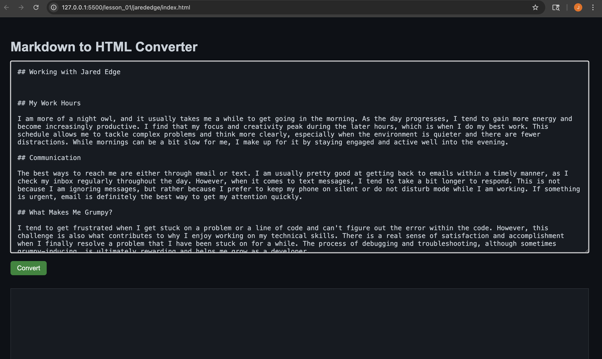
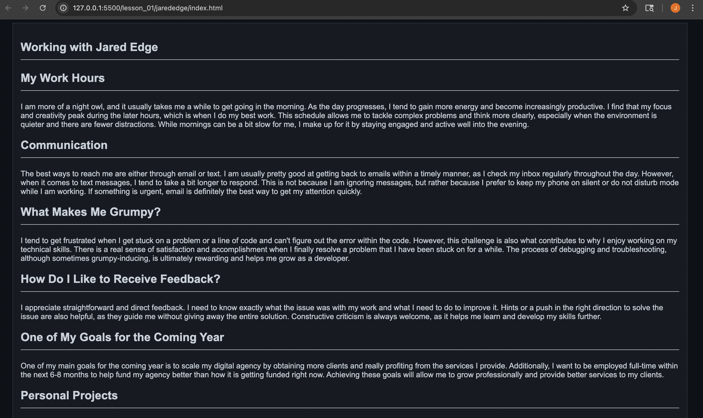
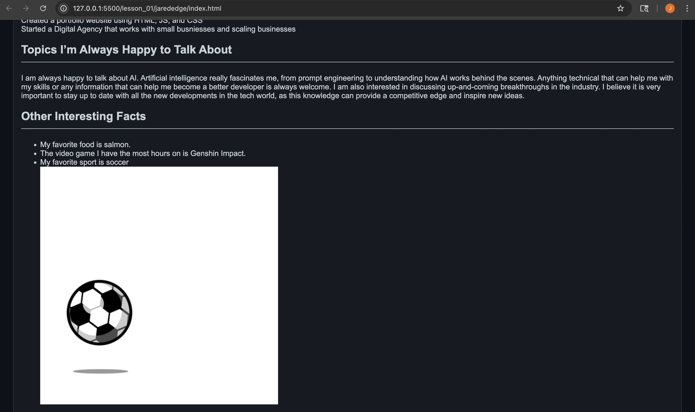
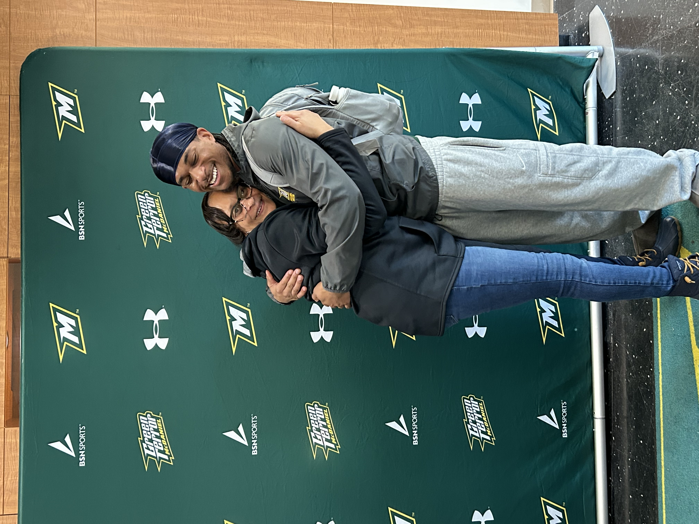
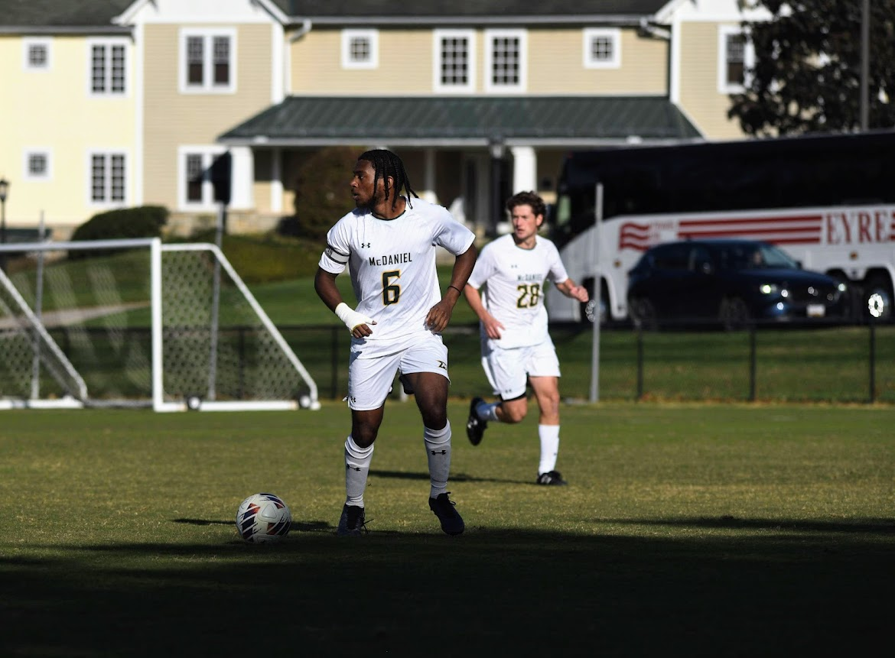

# Lesson_01 HW - Markdown to HTML Converter

## Overview

When tasked with this assignment the first thing I thought about was having the user give an input, run a program, and it would return the desired output. I originally thought about making the program in java using a scanner that takes an input of string chars and converts it into html.

Although technically it could work, it would be very difficult to do. For example, say the user input had “>”. When running through the program I would have to explicitly find a work around for distincting a string “>” and an html tag “>”.

So I began to think about another way to go about it and realized I could use a tool that I’ve used before online, a converter. There have been plenty of times where I needed to convert an image from jpg to png, jpeg, etc. Which takes an input, runs a program, and returns the desired result. The same could work with this task. I could create a simple html page that takes an input (markdown language) , runs a program, and gives the output (html language). So this is what I’ve created and I'm going to explain how it works.

---

## File Structure

### `index.html`

The `index.html` file is tasked with giving the page structure and loading dependencies. I found a dependency online that parses markdown. This does most of the work for the conversion. The rest of the file is just front-end styling with a button click that runs `convertMarkdown()` from my js file.

---

### `style.css`

The `style.css` file is solely for matching the style of github preview.

---

### `main.js`

The `main.js` file does the rest of what the parser can do on its own. For example,

html: true,   // allows for embedded html in markdown so the user can preview the conversion  
breaks: true, // and line breaks in markdown will be converted to <"br"> tags  
linkify: true // any links found in the markdown will be converted to <"a"> tags 

The second half of the js file reads the input from the <"textarea"> which is then applied to the parser using md.render(). Then the output is returned. Once returned the css styling is applied to make the html look like the 1 to 1 copy.

## Conclusion

The only issue I am still fighting is how to get images to properly appear as they do in markdown. I believe more css style to deal with photos is needed but I didn’t have enough time to complete that specific task before the due date but am still currently working on it.

## Demo

1. Input your markdown file in the top text box. 

2. Click convert 

3. You get your html conversion

## Raw HTML Output

<h2 id="working-with-jared-edge">Working with Jared Edge</h2>
<h2 id="my-work-hours">My Work Hours</h2>

I am more of a night owl, and it usually takes me a while to get going in the morning. As the day progresses, I tend to gain more energy and become increasingly productive. I find that my focus and creativity peak during the later hours, which is when I do my best work. This schedule allows me to tackle complex problems and think more clearly, especially when the environment is quieter and there are fewer distractions. While mornings can be a bit slow for me, I make up for it by staying engaged and active well into the evening.

<h2 id="communication">Communication</h2>

The best ways to reach me are either through email or text. I am usually pretty good at getting back to emails within a timely manner, as I check my inbox regularly throughout the day. However, when it comes to text messages, I tend to take a bit longer to respond. This is not because I am ignoring messages, but rather because I prefer to keep my phone on silent or do not disturb mode while I am working. If something is urgent, email is definitely the best way to get my attention quickly.

<h2 id="what-makes-me-grumpy-">What Makes Me Grumpy?</h2>

I tend to get frustrated when I get stuck on a problem or a line of code and can&#39;t figure out the error within the code. However, this challenge is also what contributes to why I enjoy working on my technical skills. There is a real sense of satisfaction and accomplishment when I finally resolve a problem that I have been stuck on for a while. The process of debugging and troubleshooting, although sometimes grumpy-inducing, is ultimately rewarding and helps me grow as a developer.

<h2 id="how-do-i-like-to-receive-feedback-">How Do I Like to Receive Feedback?</h2>

I appreciate straightforward and direct feedback. I need to know exactly what the issue was with my work and what I need to do to improve it. Hints or a push in the right direction to solve the issue are also helpful, as they guide me without giving away the entire solution. Constructive criticism is always welcome, as it helps me learn and develop my skills further.

<h2 id="one-of-my-goals-for-the-coming-year">One of My Goals for the Coming Year</h2>

One of my main goals for the coming year is to scale my digital agency by obtaining more clients and really profiting from the services I provide. Additionally, I want to be employed full-time within the next 6-8 months to help fund my agency better than how it is getting funded right now. Achieving these goals will allow me to grow professionally and provide better services to my clients.

<h2 id="personal-projects">Personal Projects</h2>

Created a gas station finder app using AI for my senior capstone
Created a portfolio website using HTML, JS, and CSS
Started a Digital Agency that works with small busniesses and scaling businesses

<h2 id="topics-i-m-always-happy-to-talk-about">Topics I’m Always Happy to Talk About</h2>

I am always happy to talk about AI. Artificial intelligence really fascinates me, from prompt engineering to understanding how AI works behind the scenes. Anything technical that can help me with my skills or any information that can help me become a better developer is always welcome. I am also interested in discussing up-and-coming breakthroughs in the industry. I believe it is very important to stay up to date with all the new developments in the tech world, as this knowledge can provide a competitive edge and inspire new ideas.

<h2 id="other-interesting-facts">Other Interesting Facts</h2>
<ul>
<li>My favorite food is salmon.</li>
<li>The video game I have the most hours on is Genshin Impact.</li>
<li>My favorite sport is soccer </li>
</ul>

